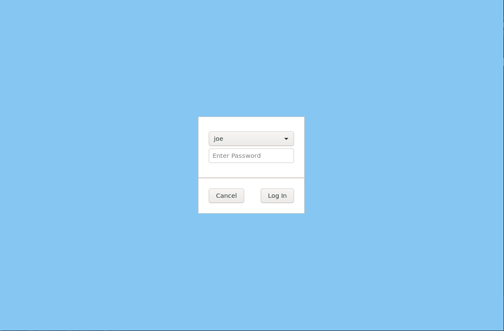

# greetd-gtk-greeter-rs

**This code is still unstable.**

A GTK greetd client, built with [Relm](https://github.com/antoyo/relm) in Rust.

Requires

## Installation

### Dependencies

- Sway
  - Uses gtk-layer-shell-rs, so it has to be run under a compositor with layer shell protocol support e.g. Sway. 
- D-Bus
  - Uses D-Bus to fetch cached users for an easy login. Might make this optional in the future. 

### Running

See the greetd wiki entry for running gtkgreet with Sway [here](https://man.sr.ht/~kennylevinsen/greetd/#using-sway-for-gtkgreet).

## Screenshots

